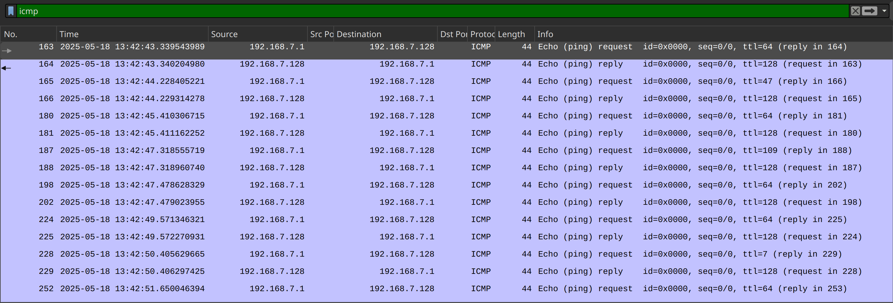

# Windows or Linux - Forensics

## Overview
A packet capture file has been provided, and the description suggests that a "Covert-channel" technique might be used in this challenge. The capture contains numerous packets and protocols.

## Solution
To identify covert channels and the exfiltrated data, it is essential to observe any unusual data patterns. One of the protocols present is **ICMP Ping** packets. By examining the packet details in Wireshark, you will notice something unusual: the TTL values.

TTL, or Time To Live, is an `IP` field that indicates how many routers a packet can traverse before reaching its destination. Each time a packet passes through a router, this number is decremented. The peculiar TTL values, such as 47 and 7, stand out because the source IP and destination IP are on the same network (no routing involved). These values are nonsensical, suggesting they are part of the covert channel we are investigating.



The TTL field has default values: **128 for Windows** and **64 for Linux**. To isolate the covert channel, we must filter out these two values, as they are likely generated by normal ICMP traffic. Use the following `tshark` command to extract the data:

```bash
tshark -r capture.pcapng -Y "icmp and icmp.type == 8 and ip.ttl != 64" -T fields -e "ip.ttl"
```

Once the data is extracted, decrypt it using `RC4` with the key provided in the challenge description.
