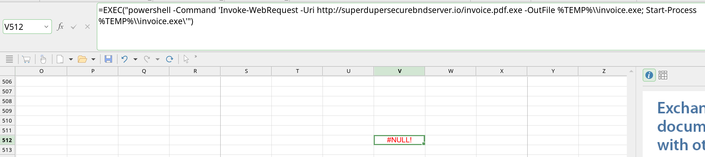

# Old Security 4.0 - Forensics

## Overview
Suspicious network traffic was detected after opening an XLS document. Both the packet capture and the XLS file are provided, suggesting that the XLS file might be malicious and the traffic could be related to malware activity.

## Solution
The packet capture contains limited information, with the most relevant being an HTTP POST request carrying encrypted data.

The XLS file does not contain any macros. Based on the challenge name "Old Security 4.0" and further research, we learn about **Excel 4.0 malware**, an older version of Excel that allows commands to be executed on the **host** using Excel formulas alone. Upon examining the document, we find a collapsed row `256`. One of its cells references another cell in row `512`, which contains the following command that downloads and executes malware:

This provides clarity for further investigation. To proceed, obtaining the malware is essential. A critical piece of information to retain is the **domain name**, which serves as an IoC (Indicator of Compromise) and could provide insights into the attacker, the malware, or the attack itself.

Searching for the domain name on `VirusTotal` (a primary tool for malware-related searches), we discover that the domain is associated with an executable.

After basic reverse engineering, the malware is found to read a secret, encrypt it using **AES-CBC 128**, and send it via an HTTP POST request to the remote server. To uncover the exfiltrated data, decrypt the data from the packet capture using the AES key and IV extracted from the executable.
