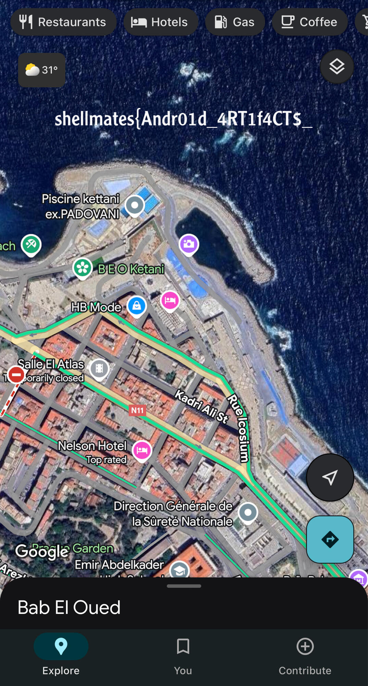

# dad jokes

## Write-up

- Our buddy is missing. We suspect that he was in contact with someone who might be connected to his disappearance. To investigate further, we need to identify the messaging app he was using.
- The messaging app we are investigating is `MeWe`. Its artifacts can be found at: `/data/data/com.mewe/`.
- All messages exchanged between Tes Ter and Anes are stored in the following database: `/data/data/com.mewe/databases/app_v3.db`.
- One image in their discussion, which indicates the meeting location, was deleted. However, Tes Ter mentioned that he saved it. It can be found at: `/sdcard/Download/where.jpeg` (first part).



- The second part of the image is in the last sent image, which was not saved. It can be retrieved using its URL found in the `MESSAGE` table of the aforementioned database.
Authentication is required to access it via the `MeWe API`. The session token is stored in: `/data/data/com.mewe/shared_prefs/SGSession.xml`.

```sh
curl -X GET "https://mewe.com/api/v2/photo/ZI-AAYvUJUCD2fh8DGaOAYweZOO1q4sWqpa_UbGMKOFoS-7RbTp2Phs6Lj8/full/image" \
-H "Cookie: access-token=<ACCESS_TOKEN>; refresh-token=<REFRESH_TOKEN>" --output image.jpg
```


## Flag

`shellmates{Andr01d_4RT1f4CT$_4RE_pR1c3L3$sSS}`