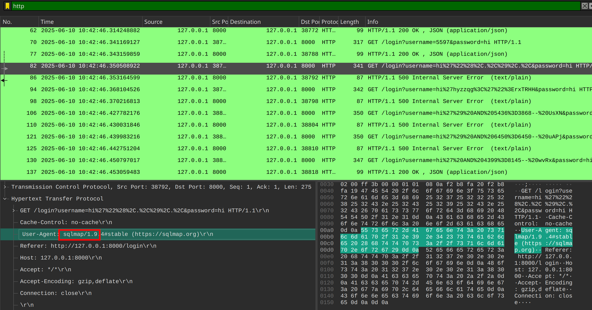

# just wait

## Write-up

- Given a pcap file mainly containing HTTP requests with SQL injection payloads targeting a vulnerable web server, the majority of them are sent using `SQLmap`.

- To have a better view, we need to filter out SQLmap requests because they're very verbose. Some of the remaining requests have a URI similar to the following (after URL decoding):  
  `/login?username=username'+AND+/*AND*/slEeP/*AND*/((SELECT+unicode(SUBSTR(password,21,1))))--&password=`  
  This exploits **Time-based SQL injection** for data exfiltration, which means:

  > `sleep X seconds`, where `X` is the ASCII value of the character at position 21 of the password.

  So the attacker is trying to exfiltrate the password using this technique.

- To find what has been exfiltrated, we need to subtract the response time from the request time of these particular packets and decode the values from ASCII.  
  The following script does the job:  
  [solve](solve.py)

## Flag
`shellmates{WAIt_f4evER}`
