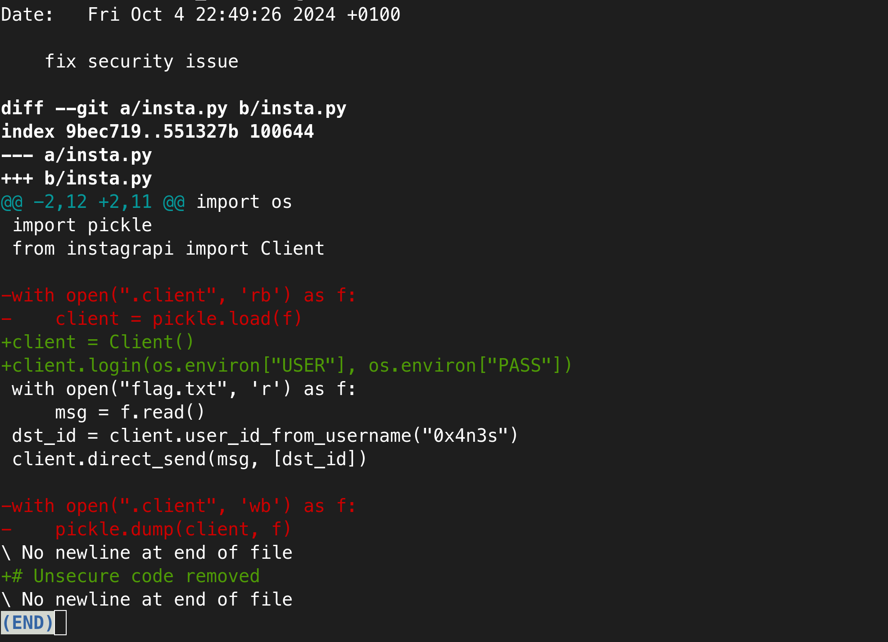
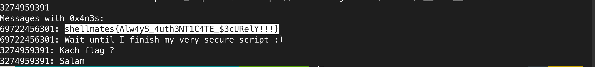

# passwordless

## Write-up

We have been given a short Python script, which uses the **Instagrapi** API to send a **flag** to a friend on Instagram with the username `0x4n3s`, but for now, we can't get the flag because the script doesn't include plain credentials. Instead, it uses environment variables.

From the description and the comment at the end of the script, we know that the code previously contained a security issue, which has been fixed—most likely within the **authentication method**.

We also have a `.git` folder, which might give us information about the previous code that was changed. If we list the commits using `git log`, we find two commits. The latest one shows the code that has been changed.

We can see that the script was serializing the object `client` and saving it to a file `.client`, which is used to avoid authenticating each time with credentials to access the Instagram account.

Since we have the `.client` file, we can load it then read the private messages with the user `0x4n3s` and get the flag we are looking for, which is all done in the [solve script](solve.py).

## Flag

`shellmates{Alw4yS_4uth3NT1C4TE_$3cURelY!!!}`
