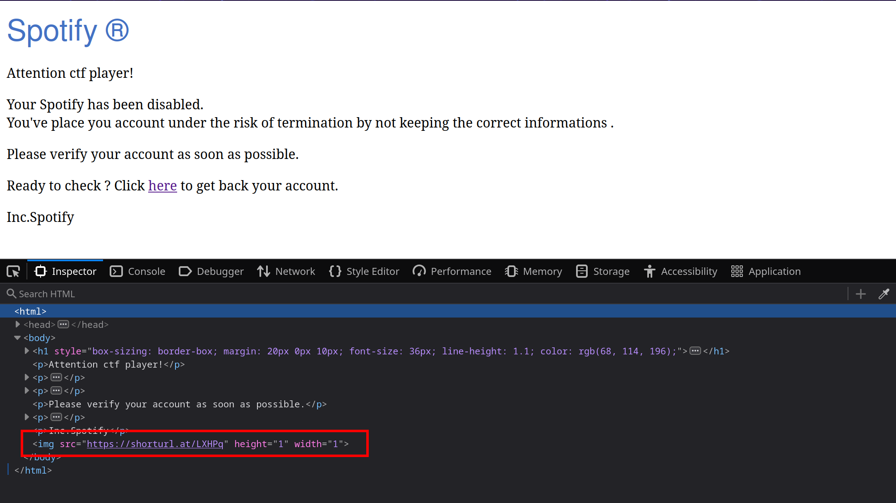

# 1x1-Eye

## Write-up

- In this challenge, we have a home directory for the user 'ctf' on Windows, and there are many things to explore, so we need to specify our scope more clearly.
- We can find a link to 'Thunderbird' in the Desktop folder, which is a famous email client. On the other hand, from the challenge name and description (1x1 Eye, spied on, pixel), this leads us to think about the **Spy Pixel** attack.
- In the **Spy Pixel** attack, an image of **1 pixel** is embedded within the HTML email, and it is used to track the recipient of the email (to find out if they opened the email, get their location, etc.), so we need to retrieve the received emails to see if one was embedded in an email.
- Many files are used to log received emails in Thunderbird; one of them is `ctf/AppData/Roaming/Thunderbird/Profiles/7z1npisu.default-esr/ImapMail/imap.gmail.com/INBOX`. We can find an HTML email in this file that seems to be sent by 'Spotify', but the suspicious image that we talked about is present in this email: ``

- If we go to that link, it will redirect us to "https://two804870804.shellmates.club/spy.png." Usually, this domain would be a malicious one; in a real scenario, we would check it on 'VirusTotal' or any sandbox. We can also visit the root to see if there is anything.
- At the root of the website, there is a 'Not found' message. The interesting thing is that it is written in `leet`; let's inspect the source...

**NOTE:** Since the Spy Pixel attack is known, we can search for its patterns (e.g., "height=1 width=1") to find the email.

## Flag

`shellmates{eM41L$_HAvE_3ye$_b3_caREFul!!}`
