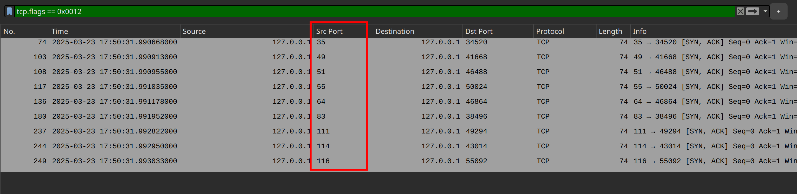

- The given pcap file contains numerous incomplete TCP handshake packets. The fact that the packets (SYN packets) are sent to sequential destination ports indicates that this is an **Nmap TCP scan**.
- Based on the challenge description, we need to identify the **open ports** discovered by Nmap (listening ports):
    - When Nmap performs a TCP port scan, it sends a **SYN** packet to a port. If the target responds with an **RST** packet, it means the port is **closed**. If the response is a **SYN-ACK** packet, it means the port is **open**.
    - The following filter can be used to reveal the SYN-ACK packets: `tcp.flags == 0x0012`
    - 

- From the challenge description, we can infer that we need to decode the ports, which appear to represent ASCII characters. Decoding them reveals the secret.

- Recognizing an Nmap scan from packet captures is useful for detecting potential cyberattacks. Identifying open ports in packet captures helps trace an attacker's steps and determine which services are being targeted, allowing for focused investigation. (The idea of decoding the ports as ASCII is included for fun)